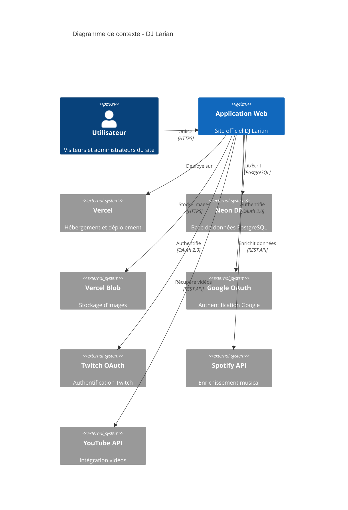
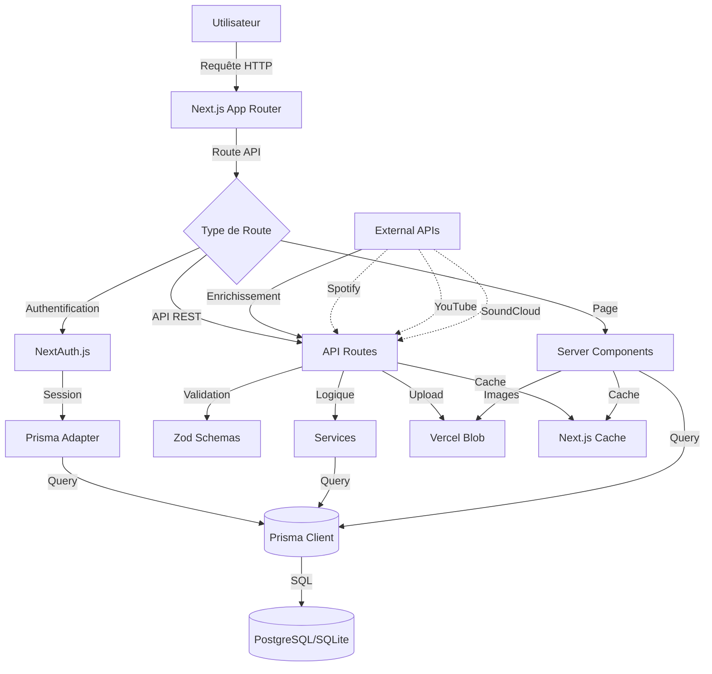
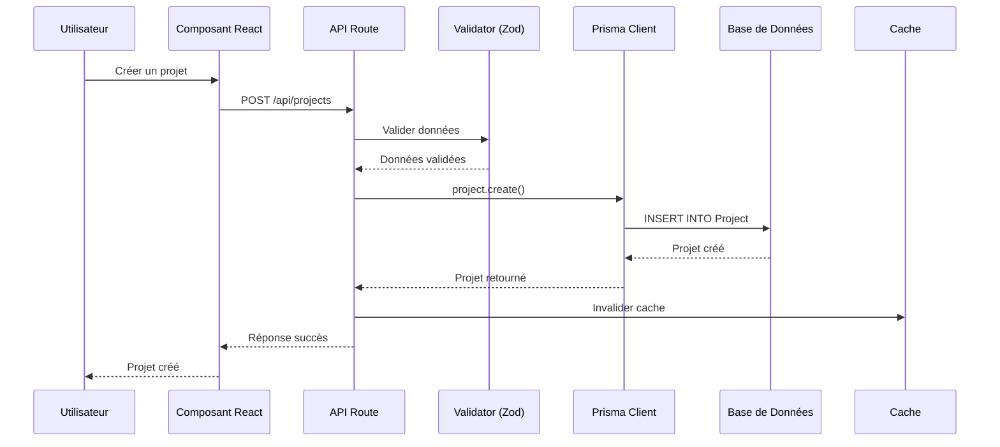
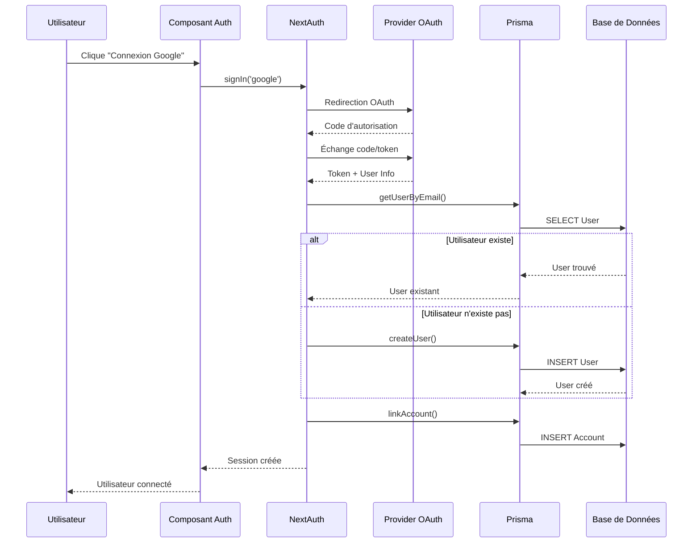

# Architecture du Projet - DJ Larian

## Vue d'ensemble

Application Next.js 16 avec App Router, TypeScript, Prisma ORM 7, et authentification NextAuth.js v5. Le projet suit une architecture modulaire avec séparation claire entre les couches présentation, logique métier et données.

## Diagramme C4 - Niveau Système



## Diagramme de Flux de Données



## Structure du Projet

```
djlarian-react/
├── src/
│   ├── app/                          # App Router Next.js
│   │   ├── (routes)/                 # Routes groupées
│   │   │   ├── (home)/              # Page d'accueil
│   │   │   ├── admin/               # Pages administrateur
│   │   │   │   ├── music/           # Gestion musique
│   │   │   │   ├── events/          # Gestion événements
│   │   │   │   ├── configuration/   # Configuration site
│   │   │   │   └── users/           # Gestion utilisateurs
│   │   │   ├── events/              # Pages événements publics
│   │   │   ├── music/               # Pages musique publiques
│   │   │   ├── projects/            # Gestion projets musicaux
│   │   │   ├── profile/             # Profil utilisateur
│   │   │   └── live/                # Panel live Twitch
│   │   ├── api/                     # API Routes
│   │   │   ├── auth/                # Authentification
│   │   │   ├── music/               # Endpoints musique
│   │   │   ├── events/              # Endpoints événements
│   │   │   ├── projects/           # Endpoints projets
│   │   │   ├── admin/               # Endpoints admin
│   │   │   ├── live/                # Endpoints live panel
│   │   │   ├── notifications/       # Endpoints notifications
│   │   │   └── upload/              # Upload d'images
│   │   └── layout.tsx               # Layout racine
│   ├── components/                  # Composants React
│   │   ├── ui/                      # Composants UI de base (Shadcn)
│   │   ├── layout/                  # Composants de layout
│   │   ├── sections/                # Sections de page
│   │   ├── admin/                   # Composants admin
│   │   ├── projects/                # Composants projets
│   │   ├── notifications/           # Composants notifications
│   │   └── 3d/                      # Visualisations 3D
│   ├── hooks/                       # Hooks personnalisés
│   │   ├── game/                    # Hooks pour le jeu audio
│   │   ├── useGameManager.ts        # Gestion du jeu
│   │   ├── useMusicPlayer.ts        # Lecteur musical
│   │   ├── useYouTubePlayer.ts      # Player YouTube
│   │   └── useSoundCloudPlayer.ts   # Player SoundCloud
│   ├── lib/                         # Bibliothèques et utilitaires
│   │   ├── api/                     # Services API
│   │   ├── services/                # Services métier
│   │   ├── utils/                   # Fonctions utilitaires
│   │   ├── prisma.ts                # Client Prisma
│   │   ├── blob.ts                  # Gestion Vercel Blob
│   │   └── logger.ts                # Logging centralisé
│   ├── types/                       # Types TypeScript
│   ├── providers/                   # Providers React
│   └── contexts/                    # Contextes React
├── prisma/
│   ├── schema.prisma                # Schéma Prisma
│   └── migrations/                   # Migrations DB
├── public/                          # Assets statiques
│   ├── images/                      # Images
│   ├── audio/                       # Fichiers audio
│   ├── videos/                      # Vidéos
│   └── locales/                     # Traductions i18n
└── scripts/                         # Scripts utilitaires
```

## Patterns Architecturaux

### 1. Composants Modulaires

Les composants volumineux sont décomposés en sous-composants et hooks :

**Exemple : `MusicCard`**

- `MusicCardImage` - Affichage de l'image
- `MusicCardControls` - Contrôles de lecture
- `MusicCardPlatforms` - Liens vers plateformes
- Hooks : `useYouTubePlayer`, `useSoundCloudPlayer`, `useAudioVisualizer`

### 2. Custom Hooks

Encapsulation de la logique réutilisable :

```typescript
// Exemple: useYouTubePlayer
export const useYouTubePlayer = ({
  track,
  isActive,
  isPlaying,
  onPlay,
}: UseYouTubePlayerProps): UseYouTubePlayerReturn => {
  // Logique de gestion du player YouTube
  return { youtubeVideoId, currentTime, ... };
};
```

**Hooks principaux :**

- `useGameManager` - Gestion du jeu audio interactif
- `useMusicPlayer` - Gestion du lecteur musical global
- `useTracks` - Gestion des pistes musicales
- `useNotifications` - Gestion des notifications
- `useImageUpload` - Upload d'images avec recadrage

### 3. Validation avec Zod

Toutes les API routes utilisent Zod pour la validation :

```typescript
const trackCreateSchema = z.object({
  title: z.string().min(1),
  artist: z.string().min(1),
  releaseDate: z.date(),
  type: z.enum(['single', 'ep', 'album']),
});

export async function POST(request: Request) {
  const body = await request.json();
  const validatedData = trackCreateSchema.parse(body);
  // ...
}
```

### 4. Gestion d'Erreurs Centralisée

- `lib/api/errorHandler.ts` - Gestion uniforme des erreurs API
- `lib/api/responseHelpers.ts` - Helpers pour réponses standardisées
- `components/ErrorBoundary.tsx` - Gestion des erreurs React

### 5. Optimisations de Performance

#### Cache Intelligent

- Utilisation de `unstable_cache` de Next.js avec tags
- Cache de 60s pour les listes, 5min pour les comptes
- Invalidation automatique lors des mutations

#### Agrégats SQL

- Utilisation de `COUNT` et `GROUP BY` au lieu de calculs en mémoire
- Réduction de la bande passante et de la mémoire

#### Images

- `next/image` pour optimisation automatique
- Conversion WebP automatique
- Lazy loading par défaut

### 6. Accessibilité

- Attributs ARIA (`aria-label`, `aria-labelledby`)
- Navigation au clavier (`tabIndex`, `onKeyDown`)
- Focus visible (`focus:ring-2`)
- Alt text descriptifs pour images
- Support des lecteurs d'écran

## Diagramme de Séquence - Création d'un Projet Musical



## Gestion d'État

### État Local

- `useState` pour état composant
- `useReducer` pour état complexe (ex: `useGameManager`)

### État Global

- **Zustand** - Gestion d'état globale légère
  - Store pour la configuration (`stores/useConfigs.ts`)
- **Context API** - Pour thème et authentification
  - `ThemeProvider` - Gestion du thème
  - `AuthProvider` - Session utilisateur

### État Serveur

- **React Server Components** - Rendu côté serveur
- **Server Actions** - Mutations côté serveur (Next.js 16)
- **API Routes** - Endpoints REST pour mutations

## Flux d'Authentification



## Modèles de Données Principaux

### User

- Authentification (email/password, OAuth)
- Rôles (USER, ADMIN)
- Relations : Projects, Events, Tracks, Notifications

### Project

- Gestion de projets musicaux
- Suivi des streams (J7, J14, J21, J28, J56, J84, J180, J365)
- Statuts : EN_COURS, TERMINE, ANNULE, A_REWORK, GHOST_PRODUCTION

### Track

- Pistes musicales
- Relations : Platforms, Genres, Collections
- Publication programmée

### Event

- Événements et concerts
- Récurrence configurable
- Tickets et informations de vente

### Notification

- Notifications génériques
- Types : MILESTONE, ADMIN_MESSAGE, RELEASE_UPCOMING
- Archivage et suppression douce

## Sécurité

### Authentification

- NextAuth.js v5 avec providers multiples (Google, Twitch, Credentials)
- Sessions sécurisées avec cookies HTTP-only
- Protection CSRF intégrée

### Validation

- Zod pour validation côté serveur
- Sanitization des inputs
- Rate limiting sur endpoints sensibles

### Autorisation

- Rôles utilisateurs (USER, ADMIN)
- Middleware pour routes protégées
- Vérification dans API routes

### Headers de Sécurité

- Headers HTTP configurés dans `next.config.ts`
- HSTS, X-Frame-Options, CSP, etc.

## Performance

### Optimisations Implémentées

- Code splitting automatique (Next.js)
- Lazy loading des composants
- Image optimization (next/image)
- Mémorisation des calculs coûteux
- Cache avec invalidation intelligente
- Agrégats SQL pour statistiques

### Monitoring

- Logger centralisé (`lib/logger.ts`)
- Error tracking (Sentry)
- Analytics (Umami, Vercel Analytics)
- Speed Insights (Vercel)

## Tests

### Structure

- Tests unitaires : `__tests__/` dans chaque module
- Tests E2E : `cypress/e2e/`
- Tests composants : Jest + Testing Library

### Couverture

- Endpoints API (`/api/projects/**`, `/api/music/**`)
- Composants clients (`ProjectsClient`, `AdminProjectsClient`)
- Hooks personnalisés
- Utilitaires critiques

## Déploiement

### Plateforme

- **Vercel** (recommandé) - Support natif Next.js
- Edge Functions pour logique légère
- CDN global automatique

### Base de Données

- **PostgreSQL** (production) - Neon DB
- **SQLite** (développement local)
- Migrations automatiques avec Prisma

### Stockage

- **Vercel Blob Storage** - Images et assets
- CDN intégré
- Conversion WebP automatique

## Évolutions Futures

### Améliorations Prévues

1. **Tests** - Augmenter la couverture
2. **Performance** - Optimiser davantage les requêtes DB
3. **Accessibilité** - Audit complet WCAG 2.1
4. **Documentation** - JSDoc complet
5. **Monitoring** - Dashboard de métriques

### Patterns à Adopter

- Server Actions pour mutations (Next.js 16)
- Streaming SSR pour meilleure UX
- Edge Functions pour logique légère
- Incremental Static Regeneration (ISR)

## Références

- [Next.js Documentation](https://nextjs.org/docs)
- [Prisma Documentation](https://www.prisma.io/docs)
- [Zod Documentation](https://zod.dev)
- [NextAuth.js Documentation](https://next-auth.js.org)
- [TailwindCSS Documentation](https://tailwindcss.com/docs)
